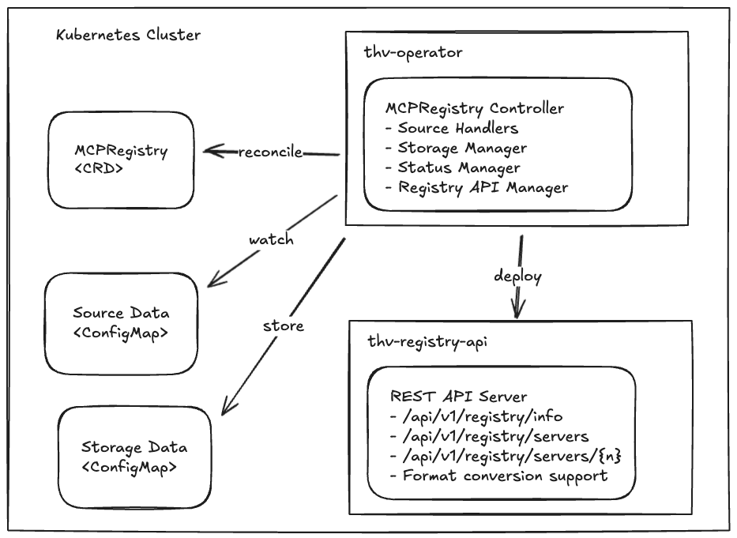

# MCP Registry on Kubernetes MVP#1 Design

## Overview

This document describes the design and implementation of a Kubernetes-native solution for managing MCP (Model Context Protocol) server registries using the ToolHive software.

The solution provides a declarative approach to registry management through Custom Resource Definitions (CRDs) and includes a REST API for programmatic access.

This MVP#1 implementation can be extended with additional functionalities in future phases, as there are no existing similar deployments in the upstream MCP specifications ([1]).

## Goals and Objectives

### Primary Goals
- **Runtime Migration**: Migrate existing local registry functionalities to Kubernetes cluster environment
- **Kubernetes-native**: Fully integrated with Kubernetes using operators and CRDs
- **Declarative Management**: Registry configuration through Kubernetes manifests to simplify DevOps operations
- **Multi-source Support**: Extensible architecture for various registry data sources
- **Format Flexibility**: Support for both upstream [2] and ToolHive [3] registry formats
- **REST API Access**: HTTP endpoints for programmatic registry interaction, compliant with the upstream schema [4]
- **Server Lifecycle Management**: Automated watching of MCP servers using label-based associations
- **Automated Operations**: Automated sync capabilities

### Non-Goals (Future Phases)
Ordered by decreasing priority:
- `thv` CLI integration changes
- Support for other source types: URL, git, registry
- Authentication/authorization
- Advanced deployment configurations (replicas, resources, expose route, ...)
- Server build workflows (for non-docker packages like `npm` and `python`) 
- Server validation workflows (including MCP security checks) 
- Registry federation and aggregation
- Registry publishing/contribution workflows
- Catalog definition with configurable validation policies
- Advanced telemetry and tracing capabilities

## Architecture Overview



## Core Components

### 1. MCPRegistry Custom Resource Definition (CRD)

The `MCPRegistry` CRD defines the desired state of a registry and its configuration.
The `spec` section provides configuration options for:
* data source: 
  * only `configmap` is initially supported
  * data format: both `upstream` and `toolhive`
* data synchronization policies
* include/exclude filters by pattern matching or tags

#### Spec Structure
```yaml
apiVersion: toolhive.stacklok.dev/v1alpha1
kind: MCPRegistry
metadata:
  name: production-registry
  namespace: toolhive-system
spec:
  displayName: "Production MCP Server Registry"
  source:
    type: configmap
    format: toolhive  # `upstream` format could be moved to MVP-2
    configmap:
      name: registry-data
      namespace: toolhive-system
      key: registry.json
  syncPolicy:
    type: automatic
    interval: 1h
    retryPolicy: # This could be moved to MVP-2
      maxAttempts: 3
      backoffInterval: 30s
      backoffMultiplier: "2.0"
  filter: # This could be moved to MVP-2
    include: ["*"]
    exclude: ["deprecated-*"]
    tags:
      include: ["production"]
      exclude: ["experimental"]
```

The `status` section provides reconciliation status information including:
* Last synchronization statistics and timestamps
* Count of registered and deployed servers
* Registry API endpoint information
* Storage reference to the internal ConfigMap
* Conditions for data source availability and validity
* Conditions for synchronization success/failure

#### Status Structure
```yaml
status:
  phase: Ready
  message: "Successfully synced 25 servers"
  lastSyncTime: "2024-01-15T10:30:00Z"
  lastSyncHash: "a1b2c3d4e5f6"
  serverCount: 25
  deployedServerCount: 5
  syncAttempts: 0
  apiEndpoint: "http://production-registry-api.toolhive-system.svc.cluster.local:80"
  storageRef:
    type: configmap
    configMapRef:
      name: production-registry-storage
      namespace: toolhive-system
      key: data
  conditions:
    - type: SourceAvailable
      status: "True"
      reason: SourceFound
      message: "Source is available and accessible"
    - type: DataValid
      status: "True"
      reason: DataValid
      message: "Registry data is valid"
    - type: SyncSuccessful
      status: "True"
      reason: SyncSuccessful
      message: "Sync operation completed successfully"
```

### 2. thv-operator (Kubernetes Operator)

The operator manages the lifecycle of `MCPRegistry` resources and implements the reconciliation logic.

#### Controller Components

##### MCPRegistry Controller
- **Responsibility**: Main reconciliation loop for `MCPRegistry` resources
- **Functions**:
  - Source validation and data retrieval
  - Storage management and data persistence
  - Status updates and condition management
  - Registry API service deployment
  - Automatic sync scheduling
  - Watching deployed servers using label-based associations

##### Registry Reconciliation Process
1. **Trigger**: `MCPRegistry` creation, update, or scheduled sync
2. **Validation**: Source configuration validated
3. **Data Retrieval**: Source handler fetches registry data
4. **Format Detection**: Data format automatically detected
5. **Validation**: Registry data validated against schema
6. **Storage**: Data persisted to storage (`ConfigMap`)
7. **API Deployment**: Registry API service deployed/updated
8. **Status Update**: MCPRegistry status updated with results

##### Source Handler Interface
`SourceHandler` is an interface with methods to validate and sync from the external data source:

```go
type SourceHandler interface {
    // Validate validates the source configuration
    Validate(source *MCPRegistrySource) error
    
    // Sync retrieves data from the source and returns the result
    Sync(ctx context.Context, registry *MCPRegistry) (*SyncResult, error)
}

type SyncResult struct {
    Data        []byte
    Hash        string
    ServerCount int32
}
```

**Implementations:**
- `ConfigMapSourceHandler`: Retrieves registry data from Kubernetes ConfigMaps

**Future Sources** (interface ready):
- `URLSourceHandler`: HTTP/HTTPS endpoints
- `GitSourceHandler`: Git repositories
- `RegistrySourceHandler`: External registries

##### Storage Manager Interface
`StorageManager` is the interface to store registry data being imported from the external source, using the internal format:

```go
type StorageManager interface {
    // Store persists registry data
    Store(ctx context.Context, registry *mcpv1alpha1.MCPRegistry, data []byte) error
        
	// Get retrieves registry data from persistent storage
	Get(ctx context.Context, registry *mcpv1alpha1.MCPRegistry) ([]byte, error)
}
```

**Implementation:**
- `ConfigMapStorageManager`: Stores data in Kubernetes ConfigMaps

**Future Storage Options** (interface ready):
- Database storage (PostgreSQL, MySQL)
- Object storage (S3, GCS, Azure Blob)
- Persistent volumes

##### Registry API Manager
- **Responsibility**: Deploys and manages Registry API services
- **Functions**:
  - Creates Deployment and Service resources for each `MCPRegistry`
  - Updates API endpoint URLs in `MCPRegistry` status
  - Handles cleanup during `MCPRegistry` deletion

##### Deployed Server Manager
- **Responsibility**: Watches deployed servers matching the registry labels
```yaml
labels:
  toolhive.stacklok.io/registry-name: upstream-community
  toolhive.stacklok.io/registry-namespace: toolhive-system
  toolhive.stacklok.io/server-name: filesystem-server
  toolhive.stacklok.io/tier: Official
  toolhive.stacklok.io/category: filesystem
```
- **Functions**:
  - Updates deployed servers count in `MCPRegistry` status

### 3. thv-registry-api (REST API Service)

A lightweight, self-contained HTTP service that provides REST API access to registry data. Following ToolHive project conventions, this service is implemented as a standalone application in `cmd/thv-registry-api/` and leverages existing shared libraries from the `pkg/` directory.

The Registry API should be structured as:
```
  cmd/thv-registry-api/          # Self-contained REST service
  ├── main.go                    # Entry point and CLI parsing
  ├── server.go                  # HTTP server setup and routing
  ├── handlers.go                # API endpoint implementations
  ├── types.go                   # Request/response structures
  ├── Dockerfile                 # Container build
  ├── openapi.yaml               # API specification
  └── *_test.go                  # Tests
```

The registry API leverages existing ToolHive packages:
- `pkg/registry/` - Core registry functionality
- `pkg/api/` - Existing API utilities  
- `pkg/client/` - Kubernetes client utilities
#### API Endpoints

| Method | Endpoint | Description | Query Parameters |
|--------|----------|-------------|------------------|
| GET | `/health` | Health check | - |
| GET | `/readiness` | Readiness check | - |
| GET | `/openapi.yaml` | OpenAPI specification | - |
| GET | `/api/v1/registry/info` | Registry metadata | - |
| GET | `/api/v1/registry/servers` | List all servers | `format=toolhive\|upstream` |
| GET | `/api/v1/registry/servers/{name}` | Get specific server | `format=toolhive\|upstream` |
| GET | `/api/v1/registry/servers/deployed` | Get deployed server | - |
| GET | `/api/v1/registry/servers/deployed/{name}` | Get specific deployed server | - |

#### Format Conversion Support
- **Output Formats**: `toolhive`, `upstream` MCP (via query parameter, defaults to `toolhive`)
- **Conversion**: using existing FormatConverter interface

#### Deployment Model
- One API service instance per MCPRegistry
- Automatically deployed by the operator
- Service discovery through Kubernetes DNS
- Resource limits configured with reasonable defaults
- Health probes defined to ensure deployment readiness

## Registry Format Support

### ToolHive Format (Native)
```json
{
  "servers": {
    "filesystem": {
      "name": "filesystem",
      "description": "Filesystem operations server",
      "docker": {
        "image": "mcp/filesystem:latest",
        "env": {"DEBUG": "1"}
      },
      "tags": ["filesystem", "production"]
    }
  },
  "metadata": {
    "version": "1.0.0",
    "updated": "2024-01-15T10:30:00Z"
  }
}
```

### Upstream MCP Format
```json
{
  "mcpServers": {
    "filesystem": {
      "command": "docker",
      "args": ["run", "--rm", "-i", "mcp/filesystem:latest"],
      "env": {"DEBUG": "1"}
    }
  }
}
```

## Sync Policies

### Manual Sync
- **Trigger**: Annotation-based (`toolhive.stacklok.dev/sync-trigger`)
- **Use Case**: Controlled updates, testing environments

### Automatic Sync
- **Trigger**: Time-based intervals
- **Configuration**: Go duration format (`1h`, `30m`, `24h`)
- **Retry Logic**: Exponential backoff with configurable parameters 

### Retry Configuration (could go to MVP #2)
```yaml
retryPolicy:
  maxAttempts: 3          # Maximum retry attempts
  backoffInterval: 30s    # Base retry interval
  backoffMultiplier: "2.0" # Exponential backoff multiplier
```

## Security Considerations

### RBAC
The `toolhive-operator-manager-role` role will be updated to manage `mcpregistries` and `configmaps` resources.

### Authenticatin & Authorization
Moved to next MVP

## Deployment

### Registry API Deployment (Auto-generated)
The MCPRegistry API service deployment is managed by the operator controller and deploys:
- One `Deployment` with a single replica with the generated image of the `thv-registry-api` application.
- One `Service` to expose the APIs to the in-cluster consumers

## CI/CD Pipeline

### Container Image Build
The existing GitHub action in `.github/workflows/image-build-and-publish.yml` already covers the build and publish of the operator image.

The same workflow is updated with new instructions to build and push the image for the `thv-registry-api` application.


### Testing Pipeline
Once the operator and functional tests are released, the existing workflow in `.github/workflows/test.yml`
should guarantee their execution at PR time.

## Installation
The existing installation instructions do not change with the Registry controller feature.

## Monitoring and Observability (moved to next MVP)

### Metrics
The operator exposes Prometheus metrics on `:8080/metrics`:
- `mcpregistry_sync_total`: Total sync operations
- `mcpregistry_sync_duration_seconds`: Sync operation duration
- `mcpregistry_sync_errors_total`: Sync operation errors
- `mcpregistry_servers_total`: Number of servers per registry
- `mcpregistry_deployed_servers_total`: Number of deployed servers per registry

### Logging (moved to next MVP)
Similarly to the MCPServer controller, the log level of the registry API is controlled by the `LOG_LEVEL` env var defined in each MCPRegistry instance.

**Note**: requires to add an `env` section to the CRD.

### Health Checks
- **Operator**: Built-in health endpoint at `:8081/healthz`
- **Registry API**: Health (`/health`) and readiness (`/readiness`) endpoints

## Documentation Updates

### Required Documentation Changes

#### 1. Operator README (`cmd/thv-operator/README.md`)
- Update architecture diagrams
- Configuration options
- Example MCPRegistry manifests

#### 2. API Documentation (`cmd/thv-registry-api/README.md`)
- API endpoint documentation
- Authentication setup (MVP#2)
- Client examples
- OpenAPI specification reference

#### 3. Project Docs
- Update operator docs in https://github.com/stacklok/docs-website

#### 4. Helm Chart Documentation
- No changes planned

## Testing Strategy

### Unit Tests
- Controller reconciliation logic
- Source handler implementations
- Storage manager implementations
- API handler functions
- Format conversion utilities

### Integration Tests (move to MVP#2?)
- End-to-end MCPRegistry lifecycle
- API service deployment and access
- Multi-registry scenarios
- Sync policy validation

### E2E Tests (Chainsaw)
Update E2E tests under `test/e2e/chainsaw/operator` to validate the deployment of `MCPRegistry` instances, the associated REST API and the server management functions.

Finally, include them in the `.github/workflows/operator-ci.yml` workflow.

Main validations:
- Validate the deployment of the MCPRegistry API
- Validate the response of MCPRegistry APIs
- Verify MCPServers are listed as `/api/v1/registry/servers/` if connected by the matching labels

## Implementation Plan
- CRD and basic operator (with build CI)
- ConfigMap source and store manager
- Registry API service (with build CI)
- Registry API deployment from controller
- Server management integration
- Testing and documentation

## Future Enhancements
See [Non Goals](#non-goals-future-phases) section.

## Migration Path

### From Standalone to Kubernetes
Document how to deploy an equivalent Kubernetes registry, based on `ConfigMap` storing the local data.

<!-- Hidden References -->

[1]: https://github.com/modelcontextprotocol/registry
[2]: https://github.com/modelcontextprotocol/registry/blob/main/docs/server-json/server.schema.json
[3]: https://github.com/stacklok/toolhive/blob/main/pkg/registry/data/schema.json
[4]: https://github.com/modelcontextprotocol/registry/blob/main/docs/server-registry-api/openapi.yaml