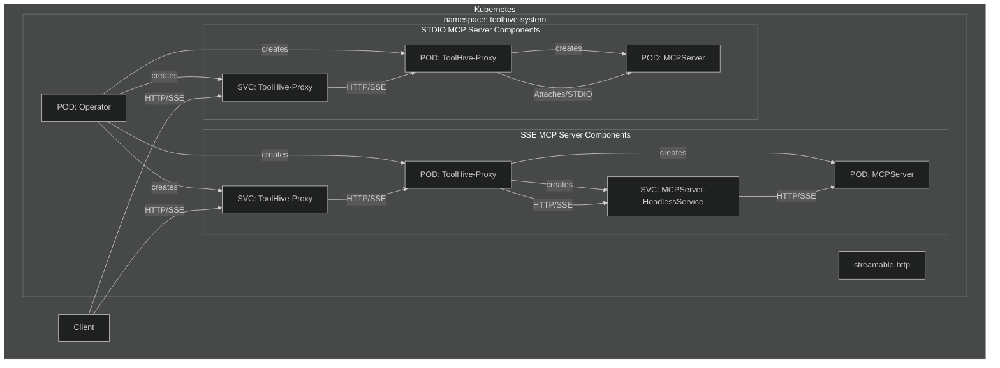

# ToolHive Kubernetes Operator

The ToolHive Kubernetes Operator manages MCP (Model Context Protocol) servers in Kubernetes clusters. It allows you to define MCP servers as Kubernetes resources and automates their deployment and management.

This operator is built using [Kubebuilder](https://book.kubebuilder.io/), a framework for building Kubernetes APIs using Custom Resource Definitions (CRDs).

## Overview

The operator introduces two Custom Resource Definitions (CRDs) for managing MCP infrastructure:

### MCPServer
Represents an individual MCP server in Kubernetes. When you create an `MCPServer` resource, the operator automatically:

1. Creates a Deployment to run the MCP server
2. Sets up a Service to expose the MCP server
3. Configures the appropriate permissions and settings
4. Manages the lifecycle of the MCP server

### MCPRegistry
Manages MCP server registries for centralized server definitions. When you create an `MCPRegistry` resource, the operator automatically:

1. Synchronizes registry data from various sources (ConfigMap, URL, Git)
2. Converts between different registry formats (ToolHive and upstream)
3. Stores processed registry data in ConfigMaps (configurable storage backends planned for future releases)
4. Provides automatic or manual synchronization policies
5. Enables GitOps workflows for registry management



## Installation

### Prerequisites

- Kubernetes cluster (v1.19+)
- kubectl configured to communicate with your cluster

### Installing the Operator via Helm

1. Install the CRD:

```bash
helm upgrade -i toolhive-operator-crds oci://ghcr.io/stacklok/toolhive/toolhive-operator-crds
```

2. Install the operator:

```bash
helm upgrade -i <release_name> oci://ghcr.io/stacklok/toolhive/toolhive-operator --version=<version> -n toolhive-system --create-namespace
```

## Usage

### Managing MCP Registries

To create an MCP registry that syncs from a ConfigMap:

```yaml
apiVersion: toolhive.stacklok.dev/v1alpha1
kind: MCPRegistry
metadata:
  name: toolhive-community-registry
  namespace: toolhive-system
spec:
  displayName: "ToolHive Community Registry"
  format: toolhive
  source:
    type: configmap
    configmap:
      name: toolhive-registry-data
      key: registry.json
  syncPolicy:
    type: automatic
    interval: "1h"
    retryPolicy:
      maxAttempts: 3
      backoffInterval: "30s"
  filter:
    tags:
      include: ["database", "api"]
      exclude: ["experimental"]
```

For detailed MCPRegistry configuration options and examples, see the [MCPRegistry documentation](../../examples/operator/mcp-registries/README.md).

### Creating an MCP Server

To create an MCP server, define an `MCPServer` resource and apply it to your cluster:

```yaml
apiVersion: toolhive.stacklok.dev/v1alpha1
kind: MCPServer
metadata:
  name: fetch
spec:
  image: docker.io/mcp/fetch
  transport: stdio
  port: 8080
  permissionProfile:
    type: builtin
    name: network
  resources:
    limits:
      cpu: "100m"
      memory: "128Mi"
    requests:
      cpu: "50m"
      memory: "64Mi"
```

Apply this resource:

```bash
kubectl apply -f your-mcpserver.yaml
```

### Using Secrets

For MCP servers that require authentication tokens or other secrets:

```yaml
apiVersion: toolhive.stacklok.dev/v1alpha1
kind: MCPServer
metadata:
  name: github
  namespace: toolhive-system
spec:
  image: ghcr.io/github/github-mcp-server
  transport: stdio
  port: 8080
  permissionProfile:
    type: builtin
    name: network
  secrets:
    - name: github-token
      key: token
      targetEnvName: GITHUB_PERSONAL_ACCESS_TOKEN
```

First, create the secret:

```bash
kubectl create secret generic github-token -n toolhive-system --from-literal=token=<YOUR_GITHUB_TOKEN>
```

Then apply the MCPServer resource.

The `secrets` field has the following parameters:
- `name`: The name of the Kubernetes secret (required)
- `key`: The key in the secret itself (required)
- `targetEnvName`: The environment variable to be used when setting up the secret in the MCP server (optional). If left unspecified, it defaults to the key.

### Checking Status

#### MCP Registries

To check the status of your MCP registries:

```bash
kubectl get mcpregistry -n toolhive-system
```

This will show the phase, source type, format, server count, and last sync time.

For more details about a specific registry:

```bash
kubectl describe mcpregistry <name> -n toolhive-system
```

#### MCP Servers

To check the status of your MCP servers:

```bash
kubectl get mcpservers
```

This will show the status, URL, and age of each MCP server.

For more details about a specific MCP server:

```bash
kubectl describe mcpserver <name>
```

## Configuration Reference

### MCPRegistry Spec

| Field          | Description                                       | Required | Default   |
|----------------|---------------------------------------------------|----------|-----------|
| `displayName`  | Human-readable name for the registry             | No       | -         |
| `format`       | Registry data format (toolhive, upstream)        | No       | toolhive  |
| `source`       | Source configuration for registry data           | Yes      | -         |
| `syncPolicy`   | Synchronization behavior and timing              | No       | manual    |
| `filter`       | Include/exclude criteria for servers             | No       | -         |

#### Source Types

- **configmap**: References a ConfigMap containing registry data
- **url**: HTTP/HTTPS endpoint serving registry JSON
- **git**: Git repository source (planned)
- **registry**: External registry reference (planned)

#### Sync Intervals

Use Go duration format: `"30s"`, `"5m"`, `"1h"`, `"24h"`, `"168h"` (1 week)

### MCPServer Spec

| Field               | Description                                      | Required | Default |
|---------------------|--------------------------------------------------|----------|---------|
| `image`             | Container image for the MCP server               | Yes      | -       |
| `transport`         | Transport method (stdio, streamable-http or sse) | No       | stdio   |
| `port`              | Port to expose the MCP server on                 | No       | 8080    |
| `targetPort`        | Port that MCP server listens to                  | No       | -       |
| `args`              | Additional arguments to pass to the MCP server   | No       | -       |
| `env`               | Environment variables to set in the container    | No       | -       |
| `volumes`           | Volumes to mount in the container                | No       | -       |
| `resources`         | Resource requirements for the container          | No       | -       |
| `secrets`           | References to secrets to mount in the container  | No       | -       |
| `permissionProfile` | Permission profile configuration                 | No       | -       |
| `tools`             | Allow-list filter on the list of tools           | No       | -       |

### Permission Profiles

Permission profiles can be configured in two ways:

1. Using a built-in profile:

```yaml
permissionProfile:
  type: builtin
  name: network  # or "none"
```

2. Using a ConfigMap:

```yaml
permissionProfile:
  type: configmap
  name: my-permission-profile
  key: profile.json
```

The ConfigMap should contain a JSON permission profile.

## Examples

- See the `examples/operator/mcp-registries/` directory for MCPRegistry examples and detailed configuration documentation
- See the `examples/operator/mcp-servers/` directory for MCPServer examples

## Development

### Building the Operator

To build the operator:

```bash
go build -o bin/thv-operator cmd/thv-operator/main.go
```

### Running Locally

For development, you can run the operator locally:

```bash
go run cmd/thv-operator/main.go
```

This will use your current kubeconfig to connect to the cluster.

### Using Kubebuilder

This operator is scaffolded using Kubebuilder. If you want to make changes to the API or controller, you can use Kubebuilder commands to help you.

#### Prerequisites

- Install Kubebuilder: https://book.kubebuilder.io/quick-start.html#installation

#### Common Commands

Generate CRD manifests:
```bash
kubebuilder create api --group toolhive --version v1alpha1 --kind MCPServer
```

Update CRD manifests after changing API types:
```bash
task operator-manifests
```

Run the controller locally:
```bash
task operator-run
```

#### Project Structure

The Kubebuilder project structure is as follows:

- `api/v1alpha1/`: Contains the API definitions for the CRDs
- `controllers/`: Contains the reconciliation logic for the controllers
- `config/`: Contains the Kubernetes manifests for deploying the operator
- `PROJECT`: Kubebuilder project configuration file

For more information on Kubebuilder, see the [Kubebuilder Book](https://book.kubebuilder.io/).
