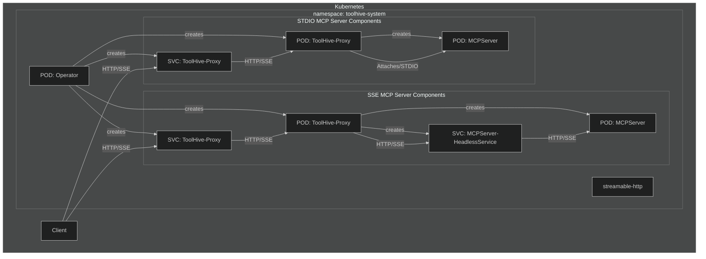

# ToolHive Kubernetes Operator

The ToolHive Kubernetes Operator manages MCP (Model Context Protocol) servers in Kubernetes clusters. It allows you to define MCP servers as Kubernetes resources and automates their deployment and management.

This operator is built using [Kubebuilder](https://book.kubebuilder.io/), a framework for building Kubernetes APIs using Custom Resource Definitions (CRDs).

## Overview

The operator introduces two Custom Resource Definitions (CRDs):
- `MCPServer` - represents an MCP server in Kubernetes
- `MCPRegistry` - collects and manages information about deployed MCP servers

When you create an `MCPServer` resource, the operator automatically:

1. Creates a Deployment to run the MCP server
2. Sets up a Service to expose the MCP server
3. Configures the appropriate permissions and settings
4. Manages the lifecycle of the MCP server

When you create an `MCPRegistry` resource, the operator:

1. Monitors MCPServer resources across namespaces
2. Maintains a MongoDB database with server information
3. Provides centralized discovery and management of MCP servers


```mermaid
---
config:
  theme: dark
  look: classic
  layout: dagre
---
flowchart LR
 subgraph Kubernetes
   direction LR
    namespace
    User1["Client"]
 end
 subgraph namespace[namespace: toolhive-system]
    operator["POD: Operator"]
    sse
    streamable-http
    stdio
 end

 subgraph sse[SSE MCP Server Components]
    operator -- creates --> THVProxySSE[POD: ToolHive-Proxy] & TPSSSE[SVC: ToolHive-Proxy]
    THVProxySSE -- creates --> MCPServerSSE[POD: MCPServer] & MCPHeadlessSSE[SVC: MCPServer-HeadlessService]
    User1 -- HTTP/SSE --> TPSSSE
    TPSSSE -- HTTP/SSE --> THVProxySSE
    THVProxySSE -- HTTP/SSE --> MCPHeadlessSSE
    MCPHeadlessSSE -- HTTP/SSE --> MCPServerSSE
 end

 subgraph stdio[STDIO MCP Server Components]
    operator -- creates --> THVProxySTDIO[POD: ToolHive-Proxy] & TPSSTDIO[SVC: ToolHive-Proxy]
    THVProxySTDIO -- creates --> MCPServerSTDIO[POD: MCPServer]
    User1 -- HTTP/SSE --> TPSSTDIO
    TPSSTDIO -- HTTP/SSE --> THVProxySTDIO
    THVProxySTDIO -- Attaches/STDIO --> MCPServerSTDIO
 end
```

## Installation

### Prerequisites

- Kubernetes cluster (v1.19+)
- kubectl configured to communicate with your cluster
- MongoDB instance (for registry functionality)

### Installing the Operator via Helm

1. Install the CRD:

```bash
helm upgrade -i toolhive-operator-crds oci://ghcr.io/stacklok/toolhive/toolhive-operator-crds
```

2. Install the operator:

```bash
helm upgrade -i <release_name> oci://ghcr.io/stacklok/toolhive/toolhive-operator --version=<version> -n toolhive-system --create-namespace
```

## Usage

### Creating an MCP Server

To create an MCP server, define an `MCPServer` resource and apply it to your cluster:

```yaml
apiVersion: toolhive.stacklok.dev/v1alpha1
kind: MCPServer
metadata:
  name: fetch
spec:
  image: docker.io/mcp/fetch
  transport: stdio
  port: 8080
  permissionProfile:
    type: builtin
    name: network
  resources:
    limits:
      cpu: "100m"
      memory: "128Mi"
    requests:
      cpu: "50m"
      memory: "64Mi"
```

Apply this resource:

```bash
kubectl apply -f your-mcpserver.yaml
```

### Using Secrets

For MCP servers that require authentication tokens or other secrets:

```yaml
apiVersion: toolhive.stacklok.dev/v1alpha1
kind: MCPServer
metadata:
  name: github
  namespace: toolhive-system
spec:
  image: ghcr.io/github/github-mcp-server
  transport: stdio
  port: 8080
  permissionProfile:
    type: builtin
    name: network
  secrets:
    - name: github-token
      key: token
      targetEnvName: GITHUB_PERSONAL_ACCESS_TOKEN
```

First, create the secret:

```bash
kubectl create secret generic github-token -n toolhive-system --from-literal=token=<YOUR_GITHUB_TOKEN>
```

Then apply the MCPServer resource.

The `secrets` field has the following parameters:
- `name`: The name of the Kubernetes secret (required)
- `key`: The key in the secret itself (required)
- `targetEnvName`: The environment variable to be used when setting up the secret in the MCP server (optional). If left unspecified, it defaults to the key.

### Creating an MCP Registry

To create an MCP registry that collects information about deployed servers:

```yaml
apiVersion: toolhive.stacklok.dev/v1alpha1
kind: MCPRegistry
metadata:
  name: my-registry
  namespace: toolhive-system
spec:
  url: "mongodb://mongodb:27017"
  type: "mongodb"
  refreshInterval: "1h"
  timeout: "30s"
  authentication:
    type: "basic"
    username: "registry-user"
    passwordSecretRef:
      name: "mongodb-secret"
      key: "password"
```

### Linking MCPServers to Registries

To associate an MCPServer with a registry, add annotations to the MCPServer:

```yaml
apiVersion: toolhive.stacklok.dev/v1alpha1
kind: MCPServer
metadata:
  name: my-server
  namespace: default
  annotations:
    toolhive.stacklok.dev/registry-name: "my-registry"
    toolhive.stacklok.dev/registry-namespace: "toolhive-system"
spec:
  image: docker.io/mcp/fetch
  transport: stdio
  port: 8080
  # ... other spec fields
```

The registry controller will automatically:
1. Monitor MCPServer resources with registry annotations
2. Store server information in MongoDB
3. Update the registry status with server counts and availability

### Checking MCP Server Status

To check the status of your MCP servers:

```bash
kubectl get mcpservers
```

This will show the status, URL, and age of each MCP server.

For more details about a specific MCP server:

```bash
kubectl describe mcpserver <name>
```

### Checking MCP Registry Status

To check the status of your MCP registries:

```bash
kubectl get mcpregistries
```

This will show the status, URL, server count, and age of each registry.

For more details about a specific registry:

```bash
kubectl describe mcpregistry <name>
```

## Registry Strategy

The ToolHive operator implements an event-driven registry strategy with the following characteristics:

### Architecture

- **Registry Controller Monitors Servers**: The MCPRegistry controller watches MCPServer resources and reacts to their lifecycle events (create/update/delete)
- **Decoupled Design**: MCPServers remain independent of registry implementation details
- **Cross-Namespace Discovery**: Registries can aggregate servers from multiple namespaces
- **MongoDB Storage**: Server information is stored in MongoDB for persistence and querying

### Linking Strategy

MCPServers are linked to registries using Kubernetes annotations:

- `toolhive.stacklok.dev/registry-name`: The name of the registry
- `toolhive.stacklok.dev/registry-namespace`: The namespace containing the registry

### Event Flow

1. **Server Creation**: When an MCPServer is created with registry annotations, the registry controller detects the change
2. **Database Update**: The controller stores server information in MongoDB
3. **Status Update**: The registry status is updated with server counts and availability
4. **Server Deletion**: When a server is deleted, it's automatically removed from the registry database

### MongoDB Schema

The registry stores server information in MongoDB with the following structure:

```json
{
  "_id": "namespace/server-name",
  "name": "server-name",
  "namespace": "namespace",
  "registry_id": "registry-namespace/registry-name",
  "url": "http://server-url",
  "transport": "stdio|sse|streamable-http",
  "status": "Ready|Pending|Failed",
  "created_at": "2024-01-01T00:00:00Z",
  "updated_at": "2024-01-01T00:00:00Z"
}
```

### Benefits

- **Event-Driven**: Registry automatically updates when servers change
- **Scalable**: Can handle multiple registries and namespaces
- **Observable**: Clear audit trail in MongoDB
- **Flexible**: Easy to add more metadata or change storage backend
- **Single Source of Truth**: MCPServers remain the authoritative source

## Configuration Reference

### MCPServer Spec

| Field               | Description                                      | Required | Default |
|---------------------|--------------------------------------------------|----------|---------|
| `image`             | Container image for the MCP server               | Yes      | -       |
| `transport`         | Transport method (stdio, streamable-http or sse) | No       | stdio   |
| `port`              | Port to expose the MCP server on                 | No       | 8080    |
| `targetPort`        | Port that MCP server listens to                  | No       | -       |
| `args`              | Additional arguments to pass to the MCP server   | No       | -       |
| `env`               | Environment variables to set in the container    | No       | -       |
| `volumes`           | Volumes to mount in the container                | No       | -       |
| `resources`         | Resource requirements for the container          | No       | -       |
| `secrets`           | References to secrets to mount in the container  | No       | -       |
| `permissionProfile` | Permission profile configuration                 | No       | -       |
| `tools`             | Allow-list filter on the list of tools           | No       | -       |

### MCPRegistry Spec

| Field               | Description                                      | Required | Default |
|---------------------|--------------------------------------------------|----------|---------|
| `url`               | MongoDB connection URL                           | Yes      | -       |
| `type`              | Registry type (mongodb)                          | No       | mongodb |
| `refreshInterval`   | How often to refresh registry data               | No       | 1h      |
| `timeout`           | Timeout for registry operations                  | No       | 30s     |
| `authentication`    | Authentication configuration                     | No       | -       |
| `insecureSkipVerify`| Skip TLS verification for HTTPS connections     | No       | false   |

### Permission Profiles

Permission profiles can be configured in two ways:

1. Using a built-in profile:

```yaml
permissionProfile:
  type: builtin
  name: network  # or "none"
```

2. Using a ConfigMap:

```yaml
permissionProfile:
  type: configmap
  name: my-permission-profile
  key: profile.json
```

The ConfigMap should contain a JSON permission profile.

## Examples

See the `examples/operator/mcp-servers/` directory for example MCPServer resources.

## Development

### Building the Operator

To build the operator:

```bash
go build -o bin/thv-operator cmd/thv-operator/main.go
```

### Running Locally

For development, you can run the operator locally:

```bash
go run cmd/thv-operator/main.go
```

This will use your current kubeconfig to connect to the cluster.

### Using Kubebuilder

This operator is scaffolded using Kubebuilder. If you want to make changes to the API or controller, you can use Kubebuilder commands to help you.

#### Prerequisites

- Install Kubebuilder: https://book.kubebuilder.io/quick-start.html#installation

#### Common Commands

Generate CRD manifests:
```bash
kubebuilder create api --group toolhive --version v1alpha1 --kind MCPServer
```

Update CRD manifests after changing API types:
```bash
task operator-manifests
```

Run the controller locally:
```bash
task operator-run
```

#### Project Structure

The Kubebuilder project structure is as follows:

- `api/v1alpha1/`: Contains the API definitions for the CRDs
- `controllers/`: Contains the reconciliation logic for the controllers
- `config/`: Contains the Kubernetes manifests for deploying the operator
- `PROJECT`: Kubebuilder project configuration file

For more information on Kubebuilder, see the [Kubebuilder Book](https://book.kubebuilder.io/).
